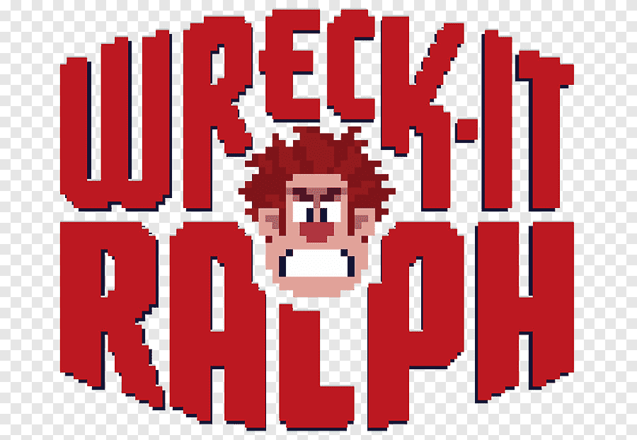

## JSGame Detona Ralph

  

Bem-vindo ao **JSGame Detona Ralph**! Neste repositório, você encontrará um jogo divertido baseado no famoso filme "Detona Ralph". 

### Tecnologias Utilizadas

- HTML5 e CSS3 para a estrutura e aparência do jogo.
- JavaScript para a lógica de programação e interatividade.
- Sprites e imagens customizadas para criar a estética única do universo de Detona Ralph.

### Funcionalidades Incríveis

- **Sistema de Pontuação**: Acompanhe sua pontuação à medida que progride no jogo e desafie seus amigos a superá-la, clique no quadrado que o Ralph se encontre

### Como Jogar

1. Clone este repositório para sua máquina local.
2. Abra o arquivo `index.html` em seu navegador web.
3. Use o mouse para clicar no Ralph.
4. Divirta-se explorando e coletando moedas!

